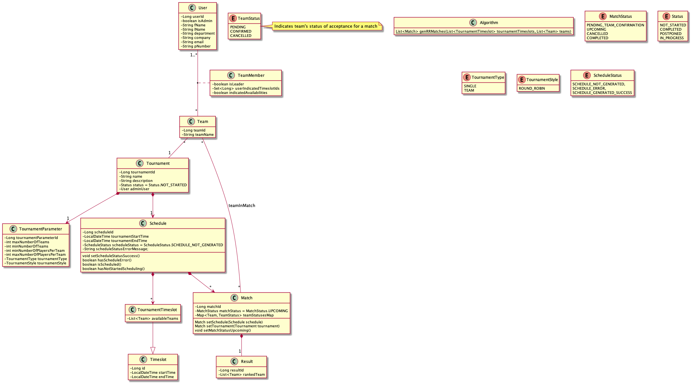
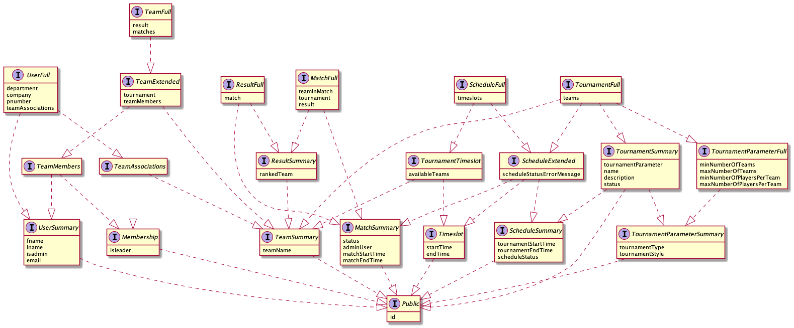
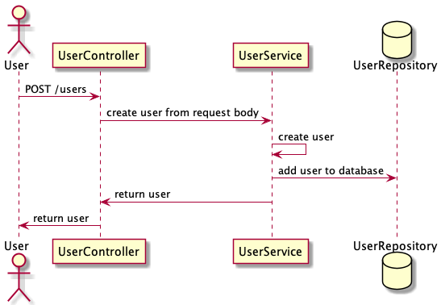
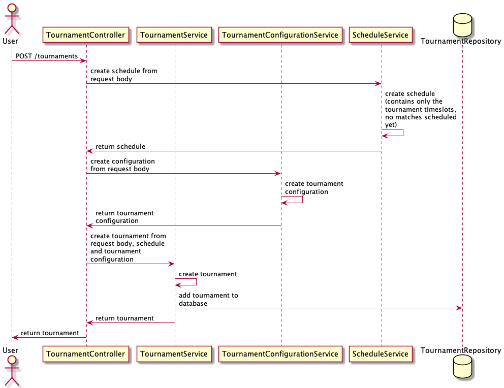
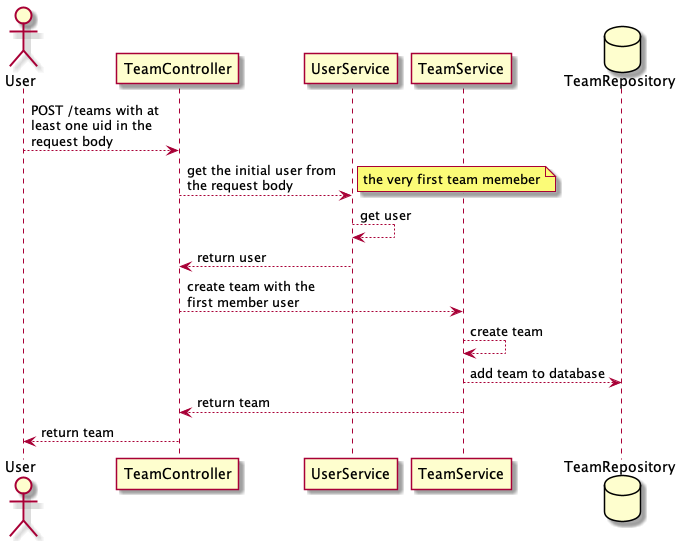
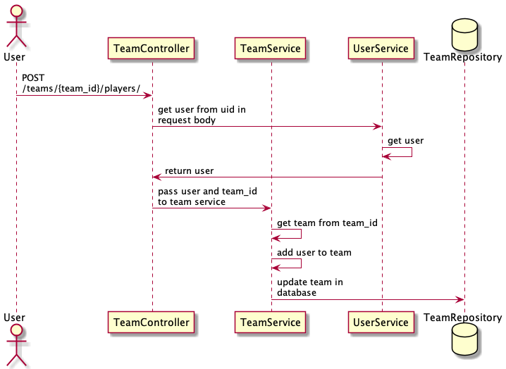
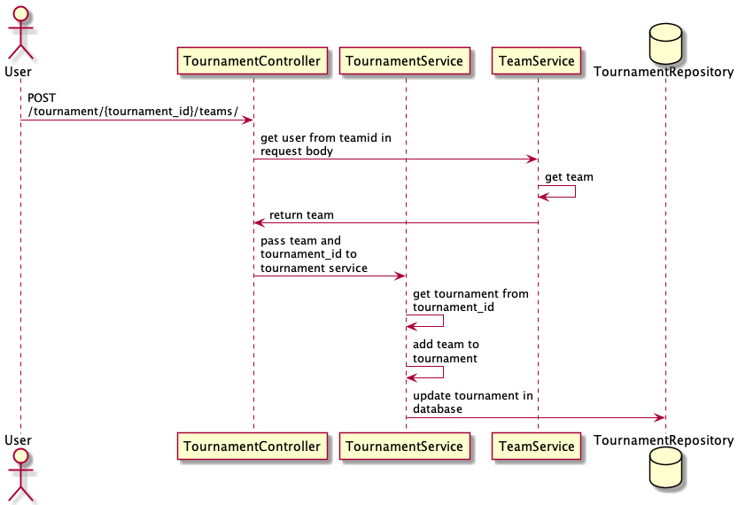
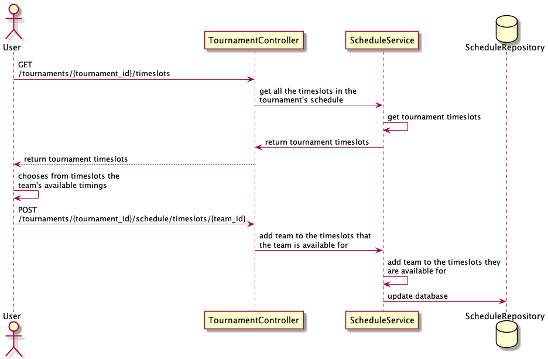

# API

## Tournaments

### GET `/tournaments`

Returns a list of all tournaments with **summarised** details.

If `user_id` is provided, will return a list containing all the tournaments with the admin user having that user id.

If `filter` is provided, will filter through the tournaments according to the filter type.

| Query Parameters | Description                                                                                                                                                                                                                       | Type      |
|------------------|-----------------------------------------------------------------------------------------------------------------------------------------------------------------------------------------------------------------------------------|-----------|
| `tournament_id`  | The Id of the tournament requested.                                                                                                                                                                                               | `integer` |
| `user_id`        | The Id of the admin user.                                                                                                                                                                                                         | `integer` |
| `filter`         | If set to `UNSCHEDULED`, the response will only contain tournaments that have not started the scheduling algorithm. If set to `SCHEDULED`, the response will only contain tournaments that have started the scheduling algorithm. | `string`  |

#### Success Response

##### HTTP Status `200`

Returns a list of tournaments based on the query type.

| Field         | Description                                          | Type       |
|---------------|------------------------------------------------------|------------|
| `tournaments` | An array of objects, each representing a tournament. | `object[]` |

`tournament`

| Field                   | Description                                                                    | Type       |
|-------------------------|--------------------------------------------------------------------------------|------------|
| `tournament_id`         | Id of tournament.                                                              | `integer`  |
| `name`                  | Name of the tournament.                                                        | `string`   |
| `description`           | Description of the tournament.                                                 | `string`   |
| `status`                | Status of the tournament.                                                      | `string`   |
| `tournament_parameters` | Configuration details of the tournament.                                       | `object`   |
| `tournament_schedule`   | Schedule details of the tournament.                                            | `object`   |

`tournament_parameters`

| Field                            | Description                                                               | Type      |
|----------------------------------|---------------------------------------------------------------------------|-----------|
| `tournament_parameter_id`        | Id of the parameter.                                                      | `integer` |
| `tournament_type`                | Type of the tournament. Will only be either `SINGLE` or `TEAM`            | `string`  |
| `tournament_style`               | Style of the tournament. Currently only `SINGLE_ROUND_ROBIN` is accepted. | `string`  |

`tournament_schedule`

| Field                           | Description                                                                                                                       | Type       |
|---------------------------------|-----------------------------------------------------------------------------------------------------------------------------------|------------|
| `schedule_id`                   | Id of the schedule.                                                                                                               | `integer`  |
| `tournament_start_time`         | Starting time of the tournament.                                                                                                  | `string`   |
| `tournament_end_time`           | Ending time of the tournament.                                                                                                    | `string`   |
| `schedule_status`               | The status of the schedule. Should only be one of `SCHEDULE_NOT_GENERATED`, `SCHEDULE_GENERATED_SUCCESS` or `SCHEDULE_ERROR`      | `string`   |

Example:

```json
{
  "tournaments": [
    {
      "name": "Ping Pong",
      "description": "A ping pong tournament",
      "status": "NOT_STARTED",
      "tournament_id": 1,
      "tournament_parameters": {
        "tournament_parameter_id": 1,
        "tournament_type": "SINGLE",
        "tournament_style": "SINGLE_ROUND_ROBIN"
      },
      "tournament_schedule": {
        "schedule_id": 1,
        "tournament_start_time": "2022-03-11T08:00:00",
        "tournament_end_time": "2022-03-11T10:00:00",
        "schedule_status": "SCHEDULE_NOT_GENERATED"
      }
    }
  ]
}
```

#### Error Response

| Field       | Description                                                                                                                                           | Type      |
|-------------|-------------------------------------------------------------------------------------------------------------------------------------------------------|-----------|
| `timestamp` | Timestamp of when the error occurred.                                                                                                                 | `string`  |
| `status`    | The HTTP status code (RFC2616, Section 6) generated by the origin server for this occurrence of the problem.                                          | `integer` |
| `error`     | A short, human-readable summary of the problem type. It shouldn't change based on the occurrence of the problem, except for purposes of localization. | `string`  |
| `message`   | A human-readable explanation specific to this occurrence of the problem.                                                                              | `string`  |
| `path`      | The url endpoint accessed at the time of error.                                                                                                       | `string`  |

### GET /tournaments/{tournament_id}

Gets a tournament specified by `tournament_id`.

#### Success Response

##### HTTP Status `200`

Returns the details of the tournament.

| Field                   | Description                                                                    | Type       |
|-------------------------|--------------------------------------------------------------------------------|------------|
| `tournament_id`         | Id of tournament.                                                              | `integer`  |
| `name`                  | Name of the tournament.                                                        | `string`   |
| `description`           | Description of the tournament.                                                 | `string`   |
| `status`                | Status of the tournament.                                                      | `string`   |
| `teams`                 | An array of objects, each representing a team participating in the tournament. | `object[]` |
| `matches`               | An array of objects, each representing a match of the tournament.              | `object[]` |
| `admin_user`            | User who created the tournament. Only contains the `user_id` field.            | `object`   |
| `tournament_parameters` | Configuration details of the tournament.                                       | `object`   |
| `tournament_schedule`   | Schedule details of the tournament.                                            | `object`   |

`team`

| Field       | Description            | Type      |
|-------------|------------------------|-----------|
| `team_id`   | Unique id of the team. | `integer` |
| `team_name` | Name of the team.      | `string`  |

`tournament_parameters`

| Field                            | Description                                                               | Type      |
|----------------------------------|---------------------------------------------------------------------------|-----------|
| `tournament_parameter_id`        | Id of the parameter.                                                      | `integer` |
| `min_number_of_teams`            | Mininum number of teams required for the tournament.                      | `integer` |
| `max_number_of_teams`            | Maximum number of teams allowed for the tournament.                       | `integer` |
| `min_number_of_players_per_team` | Minimum number of players in a team for the tournament.                   | `integer` |
| `max_number_of_players_per_team` | Maximnum number of players allowed in a team for the tournament.          | `integer` |
| `tournament_type`                | Type of the tournament. Will only be either `SINGLE` or `TEAM`            | `string`  |
| `tournament_style`               | Style of the tournament. Currently only `SINGLE_ROUND_ROBIN` is accepted. | `string`  |

`tournament_schedule`

| Field                           | Description                                                                                                                       | Type       |
|---------------------------------|-----------------------------------------------------------------------------------------------------------------------------------|------------|
| `schedule_id`                   | Id of the schedule.                                                                                                               | `integer`  |
| `tournament_start_time`         | Starting time of the tournament.                                                                                                  | `string`   |
| `tournament_end_time`           | Ending time of the tournament.                                                                                                    | `string`   |
| `schedule_status`               | The status of the schedule. Should only be one of `SCHEDULE_NOT_GENERATED`, `SCHEDULE_GENERATED_SUCCESS` or `SCHEDULE_ERROR`      | `string`   |
| `schedule_status_error_message` | If `schedule_status` is `SCHEDULE_ERROR`, then the error message will be stored in this field. If not, this will be set to `null` | `string`   |

Example:

```json
{
  "name": "Mario Kart",
  "description": "A mario kart tournament",
  "status": "NOT_STARTED",
  "teams": [
    {
      "team_id": 3,
      "team_name": "Cats"
    }
  ],
  "matches": [],
  "tournament_id": 2,
  "tournament_parameters": {
    "tournament_parameter_id": 2,
    "min_number_of_teams": 2,
    "max_number_of_teams": 3,
    "min_number_of_players_per_team": 4,
    "max_number_of_players_per_team": 4,
    "tournament_type": "TEAM",
    "tournament_style": "SINGLE_ROUND_ROBIN"
  },
  "tournament_schedule": {
    "schedule_id": 2,
    "tournament_start_time": "2022-03-20T15:00:00",
    "tournament_end_time": "2022-03-20T15:30:00",
    "schedule_status": "SCHEDULE_NOT_GENERATED",
    "schedule_status_error_message": null
  },
  "admin_user": {
    "user_id": "111-222-333"
  }
}
```

#### Error Response

| Field       | Description                                                                                                                                           | Type      |
|-------------|-------------------------------------------------------------------------------------------------------------------------------------------------------|-----------|
| `timestamp` | Timestamp of when the error occurred.                                                                                                                 | `string`  |
| `status`    | The HTTP status code (RFC2616, Section 6) generated by the origin server for this occurrence of the problem.                                          | `integer` |
| `error`     | A short, human-readable summary of the problem type. It shouldn't change based on the occurrence of the problem, except for purposes of localization. | `string`  |
| `message`   | A human-readable explanation specific to this occurrence of the problem.                                                                              | `string`  |
| `path`      | The url endpoint accessed at the time of error.                                                                                                       | `string`  |

### POST `/tournaments`

Creates a new tournament.

If `user_id` is provided as a query parameter, the administrator of the tournament will be set as the user specified
by `user_id`.

| Query Parameters | Description                                                      | Type     |
|------------------|------------------------------------------------------------------|----------|
| `user_id`        | Id of the user who will administer the newly created tournament. | `string` |

| Body Parameters         | Description                                                    | Type      |
|-------------------------|----------------------------------------------------------------|-----------|
| `name`                  | Name of the tournament.                                        | `string`  |
| `description`           | Description of the tournament.                                 | `string`  |
| `tournament_parameters` | Configuration details of the tournament.                       | `object`  |
| `tournament_schedule`   | Schedule details of the tournament.                            | `object`  |

`tournament_parameters`

| Field                            | Description                                                               | Type      |
|----------------------------------|---------------------------------------------------------------------------|-----------|
| `min_number_of_teams`            | Mininum number of teams required for the tournament.                      | `integer` |
| `max_number_of_teams`            | Maximum number of teams allowed for the tournament.                       | `integer` |
| `min_number_of_players_per_team` | Minimum number of players in a team for the tournament.                   | `integer` |
| `max_number_of_players_per_team` | Maximnum number of players allowed in a team for the tournament.          | `integer` |
| `tournament_type`                | Type of the tournament. Will only be either `SINGLE` or `TEAM`            | `string`  |
| `tournament_style`               | Style of the tournament. Currently only `SINGLE_ROUND_ROBIN` is accepted. | `string`  |

`tournament_schedule`

| Field                   | Description                                        | Type       |
|-------------------------|----------------------------------------------------|------------|
| `tournament_start_time` | Starting time of the tournament.                   | `string`   |
| `tournament_end_time`   | Ending time of the tournament.                     | `string`   |

Example:

```json
{
  "name": "Mario Kart",
  "description": "A mario kart tournament",
  "tournament_parameters": {
    "required_number_of_teams": 3,
    "min_number_of_players_per_team": 4,
    "max_number_of_players_per_team": 4,
    "tournament_type": "TEAM",
    "tournament_style": "SINGLE_ROUND_ROBIN"
  },
  "tournament_schedule": {
    "tournament_start_time": "2022-03-20T15:00:00",
    "tournament_end_time": "2022-03-20T15:30:00"
  }
}
```

#### Success Response

##### HTTP Status `200`

Returns the details of the newly created tournament.

| Field                   | Description                                                                          | Type       |
|-------------------------|--------------------------------------------------------------------------------------|------------|
| `tournament_id`         | Id of tournament.                                                                    | `integer`  |
| `name`                  | Name of the tournament.                                                              | `string`   |
| `description`           | Description of the tournament.                                                       | `string`   |
| `status`                | Status of the tournament.                                                            | `string`   |
| `teams`                 | An empty array of objects, each representing a team participating in the tournament. | `object[]` |
| `matches`               | An array of objects, each representing a match of the tournament.                    | `object[]` |
| `admin_user`            | User who created the tournament. Only contains the `user_id`.                        | `object`   |
| `tournament_parameters` | Configuration details of the tournament.                                             | `object`   |
| `tournament_schedule`   | Schedule details of the tournament.                                                  | `object`   |

`tournament_parameters`

| Field                            | Description                                                               | Type      |
|----------------------------------|---------------------------------------------------------------------------|-----------|
| `tournament_parameter_id`        | Id of the parameter.                                                      | `integer` |
| `required_number_of_teams`        | Required number of teams to play in the tournament.                       | `integer` |
| `min_number_of_players_per_team` | Minimum number of players in a team for the tournament.                   | `integer` |
| `max_number_of_players_per_team` | Maximnum number of players allowed in a team for the tournament.          | `integer` |
| `tournament_type`                | Type of the tournament. Will only be either `SINGLE` or `TEAM`            | `string`  |
| `tournament_style`               | Style of the tournament. Currently only `SINGLE_ROUND_ROBIN` is accepted. | `string`  |

`tournament_schedule`

| Field                           | Description                                                                                                                       | Type       |
|---------------------------------|-----------------------------------------------------------------------------------------------------------------------------------|------------|
| `schedule_id`                   | Id of the schedule.                                                                                                               | `integer`  |
| `tournament_start_time`         | Starting time of the tournament.                                                                                                  | `string`   |
| `tournament_end_time`           | Ending time of the tournament.                                                                                                    | `string`   |
| `schedule_status`               | The status of the schedule. Should only be one of `SCHEDULE_NOT_GENERATED`, `SCHEDULE_GENERATED_SUCCESS` or `SCHEDULE_ERROR`      | `string`   |
| `schedule_status_error_message` | If `schedule_status` is `SCHEDULE_ERROR`, then the error message will be stored in this field. If not, this will be set to `null` | `string`   |

Example:

```json
{
  "name": "Mario Kart",
  "description": "A mario kart tournament",
  "status": "NOT_STARTED",
  "teams": [],
  "matches": null,
  "tournament_id": 2,
  "tournament_parameters": {
    "tournament_parameter_id": 2,
    "required_number_of_teams": 3,
    "min_number_of_players_per_team": 4,
    "max_number_of_players_per_team": 4,
    "tournament_type": "TEAM",
    "tournament_style": "SINGLE_ROUND_ROBIN"
  },
  "tournament_schedule": {
    "schedule_id": 2,
    "tournament_start_time": "2022-03-20T15:00:00",
    "tournament_end_time": "2022-03-20T15:30:00",
    "schedule_status": "SCHEDULE_NOT_GENERATED",
    "schedule_status_error_message": null
  },
  "admin_user": {
    "user_id": "111-222-333"
  }
}
```

#### Error Response

| Field       | Description                                                                                                                                           | Type      |
|-------------|-------------------------------------------------------------------------------------------------------------------------------------------------------|-----------|
| `timestamp` | Timestamp of when the error occurred.                                                                                                                 | `string`  |
| `status`    | The HTTP status code (RFC2616, Section 6) generated by the origin server for this occurrence of the problem.                                          | `integer` |
| `error`     | A short, human-readable summary of the problem type. It shouldn't change based on the occurrence of the problem, except for purposes of localization. | `string`  |
| `message`   | A human-readable explanation specific to this occurrence of the problem.                                                                              | `string`  |
| `path`      | The url endpoint accessed at the time of error.                                                                                                       | `string`  |

### GET `/tournaments/{tournament_id}/timeslots`

Gets all timings that be used for matches for a tournament.

| Path Parameters | Description           | Type      |
|-----------------|-----------------------|-----------|
| `tournament_id` | Id of the tournament. | `integer` |

#### Success Response

##### HTTP Status `200`

Returns a list of timeslots that can be used for matches for the tournament.

| Field           | Description                                        | Type       |
|-----------------|----------------------------------------------------|------------|
| `tournament_id` | Id of the tournament.                              | `integer`  |
| `timeslots`     | An array of objects, each representing a timeslot. | `object[]` |

`timeslot`

| Field                    | Description                                                                                                                        | Type       |
|--------------------------|------------------------------------------------------------------------------------------------------------------------------------|------------|
| `tournament_timeslot_id` | Id of the timeslot.                                                                                                                | `integer`  |
| `timeslot_start_time`    | Starting date time of the timeslot.                                                                                                | `string`   |    
| `timeslot_end_time`      | Ending date time of the timeslot.                                                                                                  | `string`   |
| `available_teams`        | An array of objects, each representing a team that has indicated that they can play during the specified duration of the timeslot. | `object[]` |

`team`

| Field       | Description                                            | Type      |
|-------------|--------------------------------------------------------|-----------|
| `team_id`   | Unique id of the team that is available at the timing. | `integer` |
| `team_name` | Name of the team.                                      | `string`  |

Example:

```json
{
  "timeslots": [
    {
      "tournament_timeslot_id": 5,
      "timeslot_start_time": "2022-03-20T15:00:00",
      "timeslot_end_time": "2022-03-20T15:30:00",
      "available_teams": [
        {
          "team_id": 3,
          "team_name": "Cats"
        }
      ]
    },
    {
      "tournament_timeslot_id": 6,
      "timeslot_start_time": "2022-03-20T15:30:00",
      "timeslot_end_time": "2022-03-20T16:00:00",
      "available_teams": [
        {
          "team_id": 3,
          "team_name": "Cats"
        }
      ]
    }
  ],
  "tournament_id": 2
}
```

#### Error Response

| Field       | Description                                                                                                                                           | Type      |
|-------------|-------------------------------------------------------------------------------------------------------------------------------------------------------|-----------|
| `timestamp` | Timestamp of when the error occurred.                                                                                                                 | `string`  |
| `status`    | The HTTP status code (RFC2616, Section 6) generated by the origin server for this occurrence of the problem.                                          | `integer` |
| `error`     | A short, human-readable summary of the problem type. It shouldn't change based on the occurrence of the problem, except for purposes of localization. | `string`  |
| `message`   | A human-readable explanation specific to this occurrence of the problem.                                                                              | `string`  |
| `path`      | The url endpoint accessed at the time of error.                                                                                                       | `string`  |

### POST `/tournaments/{tournament_id}/schedule/timeslots/{team_id}`

**OBSOLETE**
Indicate all timings that the team can play for a tournament.

| Path Parameters | Description           | Type      |
|-----------------|-----------------------|-----------|
| `tournament_id` | Id of the tournament. | `integer` |
| `team_id`       | Id of the team.       | `integer` |

| Body Parameters | Description                                                                               | Type        |
|-----------------|-------------------------------------------------------------------------------------------|-------------|
| `timeslot_ids`  | An array of integers, each representing the id of the timeslot that the team can play in. | `integer[]` |

Example:

```json
{
  "timeslot_ids": [
    1,
    2,
    4
  ]
}
```

#### Success Response

##### HTTP Status `200`

A status of `200` indicates that the team's availabilities have been successfully recorded.

#### Error Response

| Field       | Description                                                                                                                                           | Type      |
|-------------|-------------------------------------------------------------------------------------------------------------------------------------------------------|-----------|
| `timestamp` | Timestamp of when the error occurred.                                                                                                                 | `string`  |
| `status`    | The HTTP status code (RFC2616, Section 6) generated by the origin server for this occurrence of the problem.                                          | `integer` |
| `error`     | A short, human-readable summary of the problem type. It shouldn't change based on the occurrence of the problem, except for purposes of localization. | `string`  |
| `message`   | A human-readable explanation specific to this occurrence of the problem.                                                                              | `string`  |
| `path`      | The url endpoint accessed at the time of error.                                                                                                       | `string`  |

### POST `/tournaments/{tournament_id}/teams`

Creates a team in the tournament specified by `tournament_id`.

| Path Parameters | Description                                 | Type      |
|-----------------|---------------------------------------------|-----------|
| `tournament_id` | Id of the tournament to create the team in. | `integer` |

| Body Parameters | Description                                            | Type     |
|-----------------|--------------------------------------------------------|----------|
| `user_id`       | User id of the team leader that is creating this team. | `string` |
| `team_name`     | Name of the team to be created.                        | `string` |

Example:

```json
{
  "user_id": "111-222-333",
  "team_name": "Dogs"
}
```

#### Success Response

##### HTTP Status `200`

Returns the details of the newly created team in the tournament.

| Field          | Description                                                                                                       | Type       |
|----------------|-------------------------------------------------------------------------------------------------------------------|------------|
| `team_id`      | Unique id of the newly created team.                                                                              | `integer`  |
| `team_name`    | Name of the newly created team.                                                                                   | `string`   |
| `matches`      | Empty array of matches that the team is participating in.                                                         | `object[]` |
| `team_members` | An array of objects, each representing a team member in the team. Should only contain details of the team leader. | `object[]` |
| `team_result`  | Results of the team. Should be `null`.                                                                            | `object`   |

`team_member`

| Field       | Description                                                                  | Type      |
|-------------|------------------------------------------------------------------------------|-----------|
| `user`      | Details of the user.                                                         | `object`  |
| `is_leader` | Boolean value indicating whether this team member is the leader of the team. | `boolean` |

`user`

| Field      | Description                                                                      | Type      |
|------------|----------------------------------------------------------------------------------|-----------|
| `user_id`  | Unique id of the user.                                                           | `string`  |
| `email`    | Email of the user.                                                               | `string`  |
| `is_admin` | Boolean value to indicate whether or not the user is a tournament administrator. | `boolean` |
| `f_name`   | First name of the user.                                                          | `string`  |
| `l_name`   | Last name of the user.                                                           | `string`  |

Example:

```json
{
  "tournament": {
    "tournament_id": 1
  },
  "matches": null,
  "team_id": 3,
  "team_name": "Cats",
  "team_members": [
    {
      "user": {
        "email": "alicewong@gmail.com",
        "user_id": "222-333-444",
        "is_admin": false,
        "f_name": "Alice",
        "l_name": "Wong"
      },
      "is_leader": true
    }
  ],
  "team_result": null
}
```

#### Error Response

| Field       | Description                                                                                                                                           | Type      |
|-------------|-------------------------------------------------------------------------------------------------------------------------------------------------------|-----------|
| `timestamp` | Timestamp of when the error occurred.                                                                                                                 | `string`  |
| `status`    | The HTTP status code (RFC2616, Section 6) generated by the origin server for this occurrence of the problem.                                          | `integer` |
| `error`     | A short, human-readable summary of the problem type. It shouldn't change based on the occurrence of the problem, except for purposes of localization. | `string`  |
| `message`   | A human-readable explanation specific to this occurrence of the problem.                                                                              | `string`  |
| `path`      | The url endpoint accessed at the time of error.                                                                                                       | `string`  |

### POST `tournaments/actions/gen_match_schedule/{tournament_id}`

Generate a round-robin match schedule for the tournament.

| Path Parameters | Description           | Type      |
|-----------------|-----------------------|-----------|
| `tournament_id` | Id of the tournament. | `integer` |

#### Success Response

##### HTTP Status `202`

A status of `202` indicates that the scheduling algorithm has been started.

#### Error Response

| Field       | Description                                                                                                                                           | Type      |
|-------------|-------------------------------------------------------------------------------------------------------------------------------------------------------|-----------|
| `timestamp` | Timestamp of when the error occurred.                                                                                                                 | `string`  |
| `status`    | The HTTP status code (RFC2616, Section 6) generated by the origin server for this occurrence of the problem.                                          | `integer` |
| `error`     | A short, human-readable summary of the problem type. It shouldn't change based on the occurrence of the problem, except for purposes of localization. | `string`  |
| `message`   | A human-readable explanation specific to this occurrence of the problem.                                                                              | `string`  |
| `path`      | The url endpoint accessed at the time of error.                                                                                                       | `string`  |

### DELETE `/tournaments`

Delete a tournament specified by `tournament_id` in the query parameter.

| Query Parameters | Description           | Type      |
|------------------|-----------------------|-----------|
| `tournament_id`  | Id of the tournament. | `integer` |

#### Success Response

##### HTTP Status `200`

Returns the `integer` value `tournament_id` of the deleted tournament.

#### Error Response

| Field       | Description                                                                                                                                           | Type      |
|-------------|-------------------------------------------------------------------------------------------------------------------------------------------------------|-----------|
| `timestamp` | Timestamp of when the error occurred.                                                                                                                 | `string`  |
| `status`    | The HTTP status code (RFC2616, Section 6) generated by the origin server for this occurrence of the problem.                                          | `integer` |
| `error`     | A short, human-readable summary of the problem type. It shouldn't change based on the occurrence of the problem, except for purposes of localization. | `string`  |
| `message`   | A human-readable explanation specific to this occurrence of the problem.                                                                              | `string`  |
| `path`      | The url endpoint accessed at the time of error.                                                                                                       | `string`  |

### DELETE `/tournaments/{tournament_id}/teams/{team_id}`

Deletes a team from a tournament.

| Path Parameters | Description                                   | Type      |
|-----------------|-----------------------------------------------|-----------|
| `tournament_id` | Id of the tournament to delete the team from. | `integer` |
| `team_id`       | Id of the team to be deleted.                 | `integer` |

#### Success Response

##### HTTP Status `200`

Returns the details of the tournament that the team is removed from.

| Field                   | Description                                                                    | Type       |
|-------------------------|--------------------------------------------------------------------------------|------------|
| `tournament_id`         | Id of tournament.                                                              | `integer`  |
| `name`                  | Name of the tournament.                                                        | `string`   |
| `description`           | Description of the tournament.                                                 | `string`   |
| `status`                | Status of the tournament.                                                      | `string`   |
| `teams`                 | An array of objects, each representing a team participating in the tournament. | `object[]` |
| `matches`               | An array of objects, each representing a match of the tournament.              | `object[]` |
| `admin_user`            | User who created the tournament. Only contains the `user_id`.                  | `object`   |
| `tournament_parameters` | Configuration details of the tournament.                                       | `object`   |
| `tournament_schedule`   | Schedule details of the tournament.                                            | `object`   |

`team`

| Field       | Description            | Type      |
|-------------|------------------------|-----------|
| `team_id`   | Unique id of the team. | `integer` |
| `team_name` | Name of the team.      | `string`  |

`tournament_parameters`

| Field                            | Description                                                               | Type      |
|----------------------------------|---------------------------------------------------------------------------|-----------|
| `tournament_parameter_id`        | Id of the parameter.                                                      | `integer` |
| `required_number_of_teams`       | Required number of teams to play in the tournament.                       | `integer` |
| `min_number_of_players_per_team` | Minimum number of players in a team for the tournament.                   | `integer` |
| `max_number_of_players_per_team` | Maximnum number of players allowed in a team for the tournament.          | `integer` |
| `tournament_type`                | Type of the tournament. Will only be either `SINGLE` or `TEAM`            | `string`  |
| `tournament_style`               | Style of the tournament. Currently only `SINGLE_ROUND_ROBIN` is accepted. | `string`  |

`tournament_schedule`

| Field                           | Description                                                                                                                       | Type       |
|---------------------------------|-----------------------------------------------------------------------------------------------------------------------------------|------------|
| `schedule_id`                   | Id of the schedule.                                                                                                               | `integer`  |
| `tournament_start_time`         | Starting time of the tournament.                                                                                                  | `string`   |
| `tournament_end_time`           | Ending time of the tournament.                                                                                                    | `string`   |
| `schedule_status`               | The status of the schedule. Should only be one of `SCHEDULE_NOT_GENERATED`, `SCHEDULE_GENERATED_SUCCESS` or `SCHEDULE_ERROR`      | `string`   |
| `schedule_status_error_message` | If `schedule_status` is `SCHEDULE_ERROR`, then the error message will be stored in this field. If not, this will be set to `null` | `string`   |

Example:

```json
{
  "name": "Mario Kart",
  "description": "A mario kart tournament",
  "status": "NOT_STARTED",
  "teams": [],
  "matches": [],
  "tournament_id": 2,
  "tournament_parameters": {
    "tournament_parameter_id": 2,
    "required_number_of_teams": 2,
    "min_number_of_players_per_team": 1,
    "max_number_of_players_per_team": 4,
    "tournament_type": "TEAM",
    "tournament_style": "SINGLE_ROUND_ROBIN"
  },
  "tournament_schedule": {
    "schedule_id": 2,
    "tournament_start_time": "2022-03-20T15:00:00",
    "tournament_end_time": "2022-03-20T16:00:00",
    "schedule_status": "SCHEDULE_NOT_GENERATED",
    "schedule_status_error_message": null
  },
  "admin_user": {
    "user_id": "111-222-333"
  }
}
```

#### Error Response

| Field       | Description                                                                                                                                           | Type      |
|-------------|-------------------------------------------------------------------------------------------------------------------------------------------------------|-----------|
| `timestamp` | Timestamp of when the error occurred.                                                                                                                 | `string`  |
| `status`    | The HTTP status code (RFC2616, Section 6) generated by the origin server for this occurrence of the problem.                                          | `integer` |
| `error`     | A short, human-readable summary of the problem type. It shouldn't change based on the occurrence of the problem, except for purposes of localization. | `string`  |
| `message`   | A human-readable explanation specific to this occurrence of the problem.                                                                              | `string`  |
| `path`      | The url endpoint accessed at the time of error.                                                                                                       | `string`  |

### GET `/tournaments/{tournament_id}/matches`

Returns a list of matches for the tournament.

| Path Parameters | Description           | Type      |
|-----------------|-----------------------|-----------|
| `tournament_id` | Id of the tournament. | `integer` |

#### Success Response

##### HTTP Status `200`

Returns a list of matches scheduled for the tournament.

| Field     | Description                                                     | Type       |
|-----------|-----------------------------------------------------------------|------------|
| `matches` | An array of objects, each indicating a match in the tournament. | `object[]` |

Example:

```json
{
  "matches": [
    {
      "mid": 1,
      "status": "UPCOMING",
      "teams": [
        {
          "team_id": 1,
          "team_name": "hairless",
          "users": []
        },
        {
          "team_id": 2,
          "team_name": "amazon",
          "users": []
        }
      ],
      "matchStartTime": "2022-03-11T08:30:00",
      "matchEndTime": "2022-03-11T09:00:00"
    }
  ]
}
```

#### Error Response

| Field       | Description                                                                                                                                           | Type      |
|-------------|-------------------------------------------------------------------------------------------------------------------------------------------------------|-----------|
| `timestamp` | Timestamp of when the error occurred.                                                                                                                 | `string`  |
| `status`    | The HTTP status code (RFC2616, Section 6) generated by the origin server for this occurrence of the problem.                                          | `integer` |
| `error`     | A short, human-readable summary of the problem type. It shouldn't change based on the occurrence of the problem, except for purposes of localization. | `string`  |
| `message`   | A human-readable explanation specific to this occurrence of the problem.                                                                              | `string`  |
| `path`      | The url endpoint accessed at the time of error.                                                                                                       | `string`  |

### GET `/tournament_styles`

Returns a list of all tournament styles available.

#### Success Response

##### HTTP Status `200`

| Field               | Description                                              | Type       |
|---------------------|----------------------------------------------------------|------------|
| `tournament_styles` | An array of strings, each indicating a tournament style. | `string[]` |

Example:

```json
{
  "tournament_styles": [
    "SINGLE_ROUND_ROBIN",
    "DOUBLE_ROUND_ROBIN"
  ]
}
```

#### Error Response

| Field       | Description                                                                                                                                           | Type      |
|-------------|-------------------------------------------------------------------------------------------------------------------------------------------------------|-----------|
| `timestamp` | Timestamp of when the error occurred.                                                                                                                 | `string`  |
| `status`    | The HTTP status code (RFC2616, Section 6) generated by the origin server for this occurrence of the problem.                                          | `integer` |
| `error`     | A short, human-readable summary of the problem type. It shouldn't change based on the occurrence of the problem, except for purposes of localization. | `string`  |
| `message`   | A human-readable explanation specific to this occurrence of the problem.                                                                              | `string`  |
| `path`      | The url endpoint accessed at the time of error.                                                                                                       | `string`  |

### GET `/tournament_filters`

Returns a list of filter names that can be used to filter for tournaments in `GET /tournaments`.

#### Success Response

##### HTTP Status `200`

| Field                | Description                                               | Type       |
|----------------------|-----------------------------------------------------------|------------|
| `tournament_filters` | An array of strings, each indicating a tournament filter. | `string[]` |

Example:

```json
{
  "tournament_filters": [
    "UNSCHEDULED",
    "SCHEDULED"
  ]
}
```

#### Error Response

| Field       | Description                                                                                                                                           | Type      |
|-------------|-------------------------------------------------------------------------------------------------------------------------------------------------------|-----------|
| `timestamp` | Timestamp of when the error occurred.                                                                                                                 | `string`  |
| `status`    | The HTTP status code (RFC2616, Section 6) generated by the origin server for this occurrence of the problem.                                          | `integer` |
| `error`     | A short, human-readable summary of the problem type. It shouldn't change based on the occurrence of the problem, except for purposes of localization. | `string`  |
| `message`   | A human-readable explanation specific to this occurrence of the problem.                                                                              | `string`  |
| `path`      | The url endpoint accessed at the time of error.                                                                                                       | `string`  |

## Teams

### GET `/teams`

Gets all teams if no query parameters are given.

If `user_id` is specified as a query parameter, returns all teams that contains the user identified by `user_id`.

If `tournament_id` is specified as a query parameter, returns all teams that is in the tournament specified
by `tournament_id`.

**Each team entity only contains summarised details.**

If both `user_id` and `tournament_id` are provided, a HTTP Status Error `400` is returned.

| Query Parameters | Description                                                                        | Type      |
|------------------|------------------------------------------------------------------------------------|-----------|
| `user_id`        | Unique id of the user that should be a member of the teams that is being returned. | `string`  |
| `tournament_id`  | Unique Id of the tournament that the returned list of teams should be apart of.    | `integer` |

#### Success Response

##### HTTP Status `200`

Returns a list of teams.

| Field   | Description                                    | Type       |
|---------|------------------------------------------------|------------|
| `teams` | An array of objects, each representing a team. | `object[]` |

`team`

| Field          | Description                                                                                        | Type       |
|----------------|----------------------------------------------------------------------------------------------------|------------|
| `team_id`      | Unique id of the team.                                                                             | `integer`  |
| `team_name`    | Name of the team.                                                                                  | `string`   |
| `tournament`   | An object representing the tournament that the team belongs to. Only contains the `tournament_id`. | `object`   |
| `team_members` | An array of objects, each representing the team member association for the users in the team.      | `object[]` |

`team_member`

| Field       | Description                                                                  | Type      |
|-------------|------------------------------------------------------------------------------|-----------|
| `user`      | Details of the user.                                                         | `object`  |
| `is_leader` | Boolean value indicating whether this team member is the leader of the team. | `boolean` |

`user`

| Field      | Description                                                                      | Type      |
|------------|----------------------------------------------------------------------------------|-----------|
| `user_id`  | Unique id of the user.                                                           | `string`  |
| `email`    | Email of the user.                                                               | `string`  |
| `is_admin` | Boolean value to indicate whether or not the user is a tournament administrator. | `boolean` |
| `f_name`   | First name of the user.                                                          | `string`  |
| `l_name`   | Last name of the user.                                                           | `string`  |

Example:

```json
{
  "teams": [
    {
      "tournament": {
        "tournament_id": 1
      },
      "team_id": 3,
      "team_name": "Cats",
      "team_members": [
        {
          "user": {
            "email": "johnsmith@gmail.com",
            "user_id": "111-222-333",
            "is_admin": false,
            "f_name": "John",
            "l_name": "Smith"
          },
          "is_leader": true
        }
      ]
    }
  ]
}
```

#### Error Response

| Field       | Description                                                                                                                                           | Type      |
|-------------|-------------------------------------------------------------------------------------------------------------------------------------------------------|-----------|
| `timestamp` | Timestamp of when the error occurred.                                                                                                                 | `string`  |
| `status`    | The HTTP status code (RFC2616, Section 6) generated by the origin server for this occurrence of the problem.                                          | `integer` |
| `error`     | A short, human-readable summary of the problem type. It shouldn't change based on the occurrence of the problem, except for purposes of localization. | `string`  |
| `message`   | A human-readable explanation specific to this occurrence of the problem.                                                                              | `string`  |
| `path`      | The url endpoint accessed at the time of error.                                                                                                       | `string`  |

### GET `/teams/{team_id}`

Get the details of a specific team.

| Path Parameters | Description                 | Type      |
|-----------------|-----------------------------|-----------|
| `team_id`       | The unique id for the team. | `integer` |

#### Success Response

##### HTTP Status `200`

Returns the details of the team.

| Field          | Description                                                                                        | Type       |
|----------------|----------------------------------------------------------------------------------------------------|------------|
| `team_id`      | Unique id of the team.                                                                             | `integer`  |
| `team_name`    | Name of the team.                                                                                  | `string`   |
| `team_members` | An array of objects, each representing a member of the team.                                       | `object[]` |
| `matches`      | An array of objects, each representing a match that the team is playing.                           | `object[]` |
| `team_result`  | The result of this team.                                                                           | `object`   |
| `tournament`   | An object representing the tournament that the team belongs to. Only contains the `tournament_id`. | `object`   |

`team_member`

| Field       | Description                                                                  | Type      |
|-------------|------------------------------------------------------------------------------|-----------|
| `user`      | Details of the user.                                                         | `object`  |
| `is_leader` | Boolean value indicating whether this team member is the leader of the team. | `boolean` |

`user`

| Field      | Description                                                                      | Type      |
|------------|----------------------------------------------------------------------------------|-----------|
| `user_id`  | Unique id of the user.                                                           | `string`  |
| `email`    | Email of the user.                                                               | `string`  |
| `is_admin` | Boolean value to indicate whether or not the user is a tournament administrator. | `boolean` |
| `f_name`   | First name of the user.                                                          | `string`  |
| `l_name`   | Last name of the user.                                                           | `string`  |

Example:

```json
{
  "tournament": {
    "tournament_id": 1
  },
  "matches": [],
  "team_id": 3,
  "team_name": "Dogs",
  "team_members": [
    {
      "user": {
        "email": "johnsmith@gmail.com",
        "user_id": "111-222-333",
        "is_admin": false,
        "f_name": "John",
        "l_name": "Smith"
      },
      "is_leader": true
    }
  ],
  "team_result": null
}
```

#### Error Response

| Field       | Description                                                                                                                                           | Type      |
|-------------|-------------------------------------------------------------------------------------------------------------------------------------------------------|-----------|
| `timestamp` | Timestamp of when the error occurred.                                                                                                                 | `string`  |
| `status`    | The HTTP status code (RFC2616, Section 6) generated by the origin server for this occurrence of the problem.                                          | `integer` |
| `error`     | A short, human-readable summary of the problem type. It shouldn't change based on the occurrence of the problem, except for purposes of localization. | `string`  |
| `message`   | A human-readable explanation specific to this occurrence of the problem.                                                                              | `string`  |
| `path`      | The url endpoint accessed at the time of error.                                                                                                       | `string`  |

### GET `/teams/leader/{user_id}`

Gets all teams that the user, specified by `user_id`, is a leader of.

| Path Parameters | Description            | Type     |
|-----------------|------------------------|----------|
| `user_id`       | Unique id of the user. | `string` |

#### Success Response

##### HTTP Status `200`

Returns a list of all teams that the user is a leader of. Each team entity only contains summarised details.

| Field   | Description                                    | Type       |
|---------|------------------------------------------------|------------|
| `teams` | An array of objects, each representing a team. | `object[]` |

`team`

| Field          | Description                                                                                        | Type       |
|----------------|----------------------------------------------------------------------------------------------------|------------|
| `team_id`      | Unique id of the team.                                                                             | `integer`  |
| `team_name`    | Name of the team.                                                                                  | `string`   |
| `tournament`   | An object representing the tournament that the team belongs to. Only contains the `tournament_id`. | `object`   |
| `team_members` | An array of objects, each representing the team member association for the users in the team.      | `object[]` |

`team_member`

| Field       | Description                                                                  | Type      |
|-------------|------------------------------------------------------------------------------|-----------|
| `user`      | Details of the user.                                                         | `object`  |
| `is_leader` | Boolean value indicating whether this team member is the leader of the team. | `boolean` |

`user`

| Field      | Description                                                                      | Type      |
|------------|----------------------------------------------------------------------------------|-----------|
| `user_id`  | Unique id of the user.                                                           | `string`  |
| `email`    | Email of the user.                                                               | `string`  |
| `is_admin` | Boolean value to indicate whether or not the user is a tournament administrator. | `boolean` |
| `f_name`   | First name of the user.                                                          | `string`  |
| `l_name`   | Last name of the user.                                                           | `string`  |

Example:

```json
{
  "teams": [
    {
      "tournament": {
        "tournament_id": 1
      },
      "team_id": 3,
      "team_name": "Dogs"
    }
  ]
}
```

#### Error Response

| Field       | Description                                                                                                                                           | Type      |
|-------------|-------------------------------------------------------------------------------------------------------------------------------------------------------|-----------|
| `timestamp` | Timestamp of when the error occurred.                                                                                                                 | `string`  |
| `status`    | The HTTP status code (RFC2616, Section 6) generated by the origin server for this occurrence of the problem.                                          | `integer` |
| `error`     | A short, human-readable summary of the problem type. It shouldn't change based on the occurrence of the problem, except for purposes of localization. | `string`  |
| `message`   | A human-readable explanation specific to this occurrence of the problem.                                                                              | `string`  |
| `path`      | The url endpoint accessed at the time of error.                                                                                                       | `string`  |

### GET `/teams/{team_id}/member_availabilities/{user_id}`

gets a list of timeslot availabilities of the user in a team

| Path Parameters | Description                         | Type     |
|-----------------|-------------------------------------|----------|
| `team_id`       | Id of the team that the user is in. | `string` |
| `user_id`       | Id of the user.                     | `string` |

#### Success Response

##### HTTP Status `200`

Returns a list of timeslot availabilities.

| Field          | Description                                                                    | Type       |
|----------------|--------------------------------------------------------------------------------|------------|
| `timeslots`    | An array of objects, each representing a timeslot.                             | `object[]` |

`timeslot`

| Field                    | Description                    | Type      |
|--------------------------|--------------------------------|-----------|
| `tournament_timeslot_id` | Unique id of the timeslot.     | `integer` |
| `timeslot_start_time`    | Starting time of the timeslot. | `string`  |
| `timeslot_end_time`      | Ending time of the timeslot.   | `string`  |

Example:

```json
{
  "timeslots": [
    {
      "tournament_timeslot_id": 1,
      "timeslot_start_time": "2022-03-11T08:00:00",
      "timeslot_end_time": "2022-03-11T08:30:00"
    },
    {
      "tournament_timeslot_id": 2,
      "timeslot_start_time": "2022-03-11T08:30:00",
      "timeslot_end_time": "2022-03-11T09:00:00"
    },
    {
      "tournament_timeslot_id": 4,
      "timeslot_start_time": "2022-03-11T09:30:00",
      "timeslot_end_time": "2022-03-11T10:00:00"
    }
  ]
}
```

#### Error Response

| Field       | Description                                                                                                                                           | Type      |
|-------------|-------------------------------------------------------------------------------------------------------------------------------------------------------|-----------|
| `timestamp` | Timestamp of when the error occurred.                                                                                                                 | `string`  |
| `status`    | The HTTP status code (RFC2616, Section 6) generated by the origin server for this occurrence of the problem.                                          | `integer` |
| `error`     | A short, human-readable summary of the problem type. It shouldn't change based on the occurrence of the problem, except for purposes of localization. | `string`  |
| `message`   | A human-readable explanation specific to this occurrence of the problem.                                                                              | `string`  |
| `path`      | The url endpoint accessed at the time of error.                                                                                                       | `string`  |

### GET `/teams/{team_id}/team_availabilities`

Get the availabilities of a specific team.

| Path Parameters | Description                 | Type      |
|-----------------|-----------------------------|-----------|
| `team_id`       | The unique id for the team. | `integer` |

#### Success Response

##### HTTP Status `200`

Returns the list of available timeslots indicated by the team.

| Field       | Description                                        | Type       |
|-------------|----------------------------------------------------|------------|
| `timeslots` | An array of objects, each representing a timeslot. | `object[]` |

`timeslot`

| Field                    | Description                    | Type      |
|--------------------------|--------------------------------|-----------|
| `tournament_timeslot_id` | Unique id of the timeslot.     | `integer` |
| `timeslot_start_time`    | Starting time of the timeslot. | `string`  |
| `timeslot_end_time`      | Ending time of the timeslot.   | `string`  |

Example:

```json
{
  "timeslots": [
    {
      "tournament_timeslot_id": 1,
      "timeslot_start_time": "2022-03-11T08:00:00",
      "timeslot_end_time": "2022-03-11T08:30:00"
    },
    {
      "tournament_timeslot_id": 2,
      "timeslot_start_time": "2022-03-11T08:30:00",
      "timeslot_end_time": "2022-03-11T09:00:00"
    },
    {
      "tournament_timeslot_id": 4,
      "timeslot_start_time": "2022-03-11T09:30:00",
      "timeslot_end_time": "2022-03-11T10:00:00"
    }
  ]
}
```

#### Error Response

| Field       | Description                                                                                                                                           | Type      |
|-------------|-------------------------------------------------------------------------------------------------------------------------------------------------------|-----------|
| `timestamp` | Timestamp of when the error occurred.                                                                                                                 | `string`  |
| `status`    | The HTTP status code (RFC2616, Section 6) generated by the origin server for this occurrence of the problem.                                          | `integer` |
| `error`     | A short, human-readable summary of the problem type. It shouldn't change based on the occurrence of the problem, except for purposes of localization. | `string`  |
| `message`   | A human-readable explanation specific to this occurrence of the problem.                                                                              | `string`  |
| `path`      | The url endpoint accessed at the time of error.                                                                                                       | `string`  |

### POST `/teams/{team_id}/users`

Adds a list of users to the team

| Path Parameters | Description                        | Type      |
|-----------------|------------------------------------|-----------|
| `team_id`       | Id of the team to add the user to. | `integer` |

| Body Parameters | Description                                                                   | Type       |
|-----------------|-------------------------------------------------------------------------------|------------|
| `user_ids`      | An array of strings, each representing the unique id of the user to be added. | `string[]` |

Example:

```json
{
  "user_ids": [
    "111-222-333",
    "222-333-444"
  ]
}
```

#### Sucess Response

##### HTTP Status `200`

Returns the details of the updated team.

| Field          | Description                                                                                        | Type       |
|----------------|----------------------------------------------------------------------------------------------------|------------|
| `team_id`      | Unique id of the team.                                                                             | `integer`  |
| `team_name`    | Name of the team.                                                                                  | `string`   |
| `team_members` | An array of objects, each representing a member of the team.                                       | `object[]` |
| `matches`      | An array of objects, each representing a match that the team is playing.                           | `object[]` |
| `team_result`  | The result of this team.                                                                           | `object`   |
| `tournament`   | An object representing the tournament that the team belongs to. Only contains the `tournament_id`. | `object`   |

`team_member`

| Field       | Description                                                                  | Type      |
|-------------|------------------------------------------------------------------------------|-----------|
| `user`      | Details of the user.                                                         | `object`  |
| `is_leader` | Boolean value indicating whether this team member is the leader of the team. | `boolean` |

`user`

| Field      | Description                                                                      | Type      |
|------------|----------------------------------------------------------------------------------|-----------|
| `user_id`  | Unique id of the user.                                                           | `string`  |
| `email`    | Email of the user.                                                               | `string`  |
| `is_admin` | Boolean value to indicate whether or not the user is a tournament administrator. | `boolean` |
| `f_name`   | First name of the user.                                                          | `string`  |
| `l_name`   | Last name of the user.                                                           | `string`  |

Example:

```json
{
  "tournament": {
    "tournament_id": 1
  },
  "matches": [],
  "team_id": 3,
  "team_name": "Dogs",
  "team_members": [
    {
      "user": {
        "email": "alicewong@gmail.com",
        "user_id": "222-333-444",
        "is_admin": false,
        "f_name": "Alice",
        "l_name": "Wong"
      },
      "is_leader": false
    },
    {
      "user": {
        "email": "johnsmith@gmail.com",
        "user_id": "111-222-333",
        "is_admin": false,
        "f_name": "John",
        "l_name": "Smith"
      },
      "is_leader": true
    }
  ],
  "team_result": null
}
```

#### Error Response

| Field       | Description                                                                                                                                           | Type      |
|-------------|-------------------------------------------------------------------------------------------------------------------------------------------------------|-----------|
| `timestamp` | Timestamp of when the error occurred.                                                                                                                 | `string`  |
| `status`    | The HTTP status code (RFC2616, Section 6) generated by the origin server for this occurrence of the problem.                                          | `integer` |
| `error`     | A short, human-readable summary of the problem type. It shouldn't change based on the occurrence of the problem, except for purposes of localization. | `string`  |
| `message`   | A human-readable explanation specific to this occurrence of the problem.                                                                              | `string`  |
| `path`      | The url endpoint accessed at the time of error.                                                                                                       | `string`  |

### POST `/teams/{team_id}/member_availabilities/{user_id}`

Adds a set of timeslots to the user, specified by `user_id`, to set his/her availability in the team specified
by `team_id`.

| Path Parameters | Description                         | Type      |
|-----------------|-------------------------------------|-----------|
| `team_id`       | Id of the team that the user is in. | `integer` |
| `user_id`       | Id of the user.                     | `string`  |

| Body Parameters | Description                                                                    | Type        |
|-----------------|--------------------------------------------------------------------------------|-------------|
| `timeslot_ids`  | An array of ints, each representing the unique id of the timeslot to be added. | `integer[]` |

Example:

```json
{
  "timeslot_ids": [
    1,
    2,
    4
  ]
}
```

#### Sucess Response

##### HTTP Status `200`

Returns the success message.

Example:

`Member availabilities set for user with id 111-222-333`

#### Error Response

| Field       | Description                                                                                                                                           | Type      |
|-------------|-------------------------------------------------------------------------------------------------------------------------------------------------------|-----------|
| `timestamp` | Timestamp of when the error occurred.                                                                                                                 | `string`  |
| `status`    | The HTTP status code (RFC2616, Section 6) generated by the origin server for this occurrence of the problem.                                          | `integer` |
| `error`     | A short, human-readable summary of the problem type. It shouldn't change based on the occurrence of the problem, except for purposes of localization. | `string`  |
| `message`   | A human-readable explanation specific to this occurrence of the problem.                                                                              | `string`  |
| `path`      | The url endpoint accessed at the time of error.                                                                                                       | `string`  |


### POST `/teams/{team_id}/confirm_result/{match_id}`

A team of `team_id` in match of `match_id` confirms the match's result.
This sets the team's `confirmedResult` boolean value to true and check if all team’s `confirmedResult` values are true. 
When all are true, it sets the match status to be finally `OVER`.

| Path Parameters | Description                         | Type      |
|-----------------|-------------------------------------|-----------|
| `team_id`       | Id of the team. 					| `integer` |
| `match_id`      | Id of the match.                    | `integer` |

#### Success Response

##### HTTP Status `200`

Returns the success message.

Example:
`Specified team 2 has confirmed the result, but not all teams of match 11 has done it.`

or

`Specified team 2 has confirmed the result, and now all teams of match 11 has confirmed it.`


#### Error Response

| Field       | Description                                                                                                                                           | Type      |
|-------------|-------------------------------------------------------------------------------------------------------------------------------------------------------|-----------|
| `timestamp` | Timestamp of when the error occurred.                                                                                                                 | `string`  |
| `status`    | The HTTP status code (RFC2616, Section 6) generated by the origin server for this occurrence of the problem.                                          | `integer` |
| `error`     | A short, human-readable summary of the problem type. It shouldn't change based on the occurrence of the problem, except for purposes of localization. | `string`  |
| `message`   | A human-readable explanation specific to this occurrence of the problem.                                                                              | `string`  |
| `path`      | The url endpoint accessed at the time of error.                                                                                                       | `string`  |


### DELETE `/teams/{team_id}/users/{user_id}`

Deletes a user from a team.

| Path Parameters | Description                             | Type      |
|-----------------|-----------------------------------------|-----------|
| `team_id`       | Id of the team to remove the user from. | `integer` |
| `user_id`       | Id of the user to be removed.           | `integer` |

#### Success Response

##### HTTP Status `200`

Returns the details of the updated team.

| Field          | Description                                                                                        | Type       |
|----------------|----------------------------------------------------------------------------------------------------|------------|
| `team_id`      | Unique id of the team.                                                                             | `integer`  |
| `team_name`    | Name of the team.                                                                                  | `string`   |
| `team_members` | An array of objects, each representing a member of the team.                                       | `object[]` |
| `matches`      | An array of objects, each representing a match that the team is playing.                           | `object[]` |
| `team_result`  | The result of this team.                                                                           | `object`   |
| `tournament`   | An object representing the tournament that the team belongs to. Only contains the `tournament_id`. | `object`   |

`team_member`

| Field       | Description                                                                  | Type      |
|-------------|------------------------------------------------------------------------------|-----------|
| `user`      | Details of the user.                                                         | `object`  |
| `is_leader` | Boolean value indicating whether this team member is the leader of the team. | `boolean` |

`user`

| Field      | Description                                                                      | Type      |
|------------|----------------------------------------------------------------------------------|-----------|
| `user_id`  | Unique id of the user.                                                           | `string`  |
| `email`    | Email of the user.                                                               | `string`  |
| `is_admin` | Boolean value to indicate whether or not the user is a tournament administrator. | `boolean` |
| `f_name`   | First name of the user.                                                          | `string`  |
| `l_name`   | Last name of the user.                                                           | `string`  |

Example:

```json
{
  "tournament": {
    "tournament_id": 1
  },
  "matches": [],
  "team_id": 3,
  "team_name": "Dogs",
  "team_members": [
    {
      "user": {
        "email": "johnsmith@gmail.com",
        "user_id": "111-222-333",
        "is_admin": false,
        "f_name": "John",
        "l_name": "Smith"
      },
      "is_leader": true
    }
  ],
  "team_result": null
}
```

#### Error Response

| Field       | Description                                                                                                                                           | Type      |
|-------------|-------------------------------------------------------------------------------------------------------------------------------------------------------|-----------|
| `timestamp` | Timestamp of when the error occurred.                                                                                                                 | `string`  |
| `status`    | The HTTP status code (RFC2616, Section 6) generated by the origin server for this occurrence of the problem.                                          | `integer` |
| `error`     | A short, human-readable summary of the problem type. It shouldn't change based on the occurrence of the problem, except for purposes of localization. | `string`  |
| `message`   | A human-readable explanation specific to this occurrence of the problem.                                                                              | `string`  |
| `path`      | The url endpoint accessed at the time of error.                                                                                                       | `string`  |

### POST `/teams/actions/post_team_availabilities/{team_id}`

Aggregates all team member availabilities into team availabilities and indicate it in the tournament.

| Path Parameters | Description            | Type      |
|-----------------|------------------------|-----------|
| `team_id`       | Unique id of the team. | `integer` |

| Body Parameters | Description                                                                          | Type     |
|-----------------|--------------------------------------------------------------------------------------|----------|
| `user_id`       | Unique id of the user initiating the request. **Must be the id of the team leader.** | `string` |

#### Success Response

##### HTTP Status `200`

Indicates that the team availabilities have been set in the tournament.

Example:

`Team availabilities have been indicated.`

#### Error Response

| Field       | Description                                                                                                                                           | Type      |
|-------------|-------------------------------------------------------------------------------------------------------------------------------------------------------|-----------|
| `timestamp` | Timestamp of when the error occurred.                                                                                                                 | `string`  |
| `status`    | The HTTP status code (RFC2616, Section 6) generated by the origin server for this occurrence of the problem.                                          | `integer` |
| `error`     | A short, human-readable summary of the problem type. It shouldn't change based on the occurrence of the problem, except for purposes of localization. | `string`  |
| `message`   | A human-readable explanation specific to this occurrence of the problem.                                                                              | `string`  |
| `path`      | The url endpoint accessed at the time of error.                                                                                                       | `string`  |

### DELETE `teams/{team_id}/member_availabilities/{user_id}`

Resets a team member's availabilitie.

| Path Parameters | Description                             | Type      |
|-----------------|-----------------------------------------|-----------|
| `team_id`       | Id of the team to remove the user from. | `integer` |
| `user_id`       | Id of the user to be removed.           | `integer` |

#### Success Response

##### HTTP Status `200`

Returns the details of the updated team.

| Field          | Description                                                                                        | Type       |
|----------------|----------------------------------------------------------------------------------------------------|------------|
| `team_id`      | Unique id of the team.                                                                             | `integer`  |
| `team_name`    | Name of the team.                                                                                  | `string`   |
| `team_members` | An array of objects, each representing a member of the team.                                       | `object[]` |
| `matches`      | An array of objects, each representing a match that the team is playing.                           | `object[]` |
| `team_result`  | The result of this team.                                                                           | `object`   |
| `tournament`   | An object representing the tournament that the team belongs to. Only contains the `tournament_id`. | `object`   |

`team_member`

| Field       | Description                                                                  | Type      |
|-------------|------------------------------------------------------------------------------|-----------|
| `user`      | Details of the user.                                                         | `object`  |
| `is_leader` | Boolean value indicating whether this team member is the leader of the team. | `boolean` |

`user`

| Field      | Description                                                                      | Type      |
|------------|----------------------------------------------------------------------------------|-----------|
| `user_id`  | Unique id of the user.                                                           | `string`  |
| `email`    | Email of the user.                                                               | `string`  |
| `is_admin` | Boolean value to indicate whether or not the user is a tournament administrator. | `boolean` |
| `f_name`   | First name of the user.                                                          | `string`  |
| `l_name`   | Last name of the user.                                                           | `string`  |

Example:

```json
{
  "tournament": {
    "tournament_id": 1
  },
  "matches": [],
  "team_id": 3,
  "team_name": "Dogs",
  "team_members": [
    {
      "user": {
        "email": "johnsmith@gmail.com",
        "user_id": "111-222-333",
        "is_admin": false,
        "f_name": "John",
        "l_name": "Smith"
      },
      "is_leader": true
    }
  ],
  "team_result": null
}
```

#### Error Response

| Field       | Description                                                                                                                                           | Type      |
|-------------|-------------------------------------------------------------------------------------------------------------------------------------------------------|-----------|
| `timestamp` | Timestamp of when the error occurred.                                                                                                                 | `string`  |
| `status`    | The HTTP status code (RFC2616, Section 6) generated by the origin server for this occurrence of the problem.                                          | `integer` |
| `error`     | A short, human-readable summary of the problem type. It shouldn't change based on the occurrence of the problem, except for purposes of localization. | `string`  |
| `message`   | A human-readable explanation specific to this occurrence of the problem.                                                                              | `string`  |
| `path`      | The url endpoint accessed at the time of error.                                                                                                       | `string`  |

## Users

### GET `/users`

Gets all users.

#### Success Response

##### HTTP Status `200`

Returns a list of all users. Each user object only contains summarised information of the user.

| Field   | Description                                    | Type       |
|---------|------------------------------------------------|------------|
| `users` | An array of objects, each representing a user. | `object[]` |

`user`

| Field        | Description                                                              | Type      |
|--------------|--------------------------------------------------------------------------|-----------|
| `user_id`    | Unique id of the user.                                                   | `string`  |
| `f_name`     | First name of the user.                                                  | `string`  |
| `l_name`     | Last name of the user.                                                   | `string`  |
| `email`      | Email of the user.                                                       | `string`  |
| `is_admin`   | A boolean value to indicate whether the user is an administrator or not. | `boolean` |

Example:

```json
{
  "users": [
    {
      "email": "johnsmith@gmail.com",
      "user_id": "111-222-333",
      "is_admin": false,
      "f_name": "John",
      "l_name": "Smith"
    },
    {
      "email": "alicewong@gmail.com",
      "user_id": "222-333-444",
      "is_admin": false,
      "f_name": "Alice",
      "l_name": "Wong"
    },
    {
      "email": "kitkat@gmail.com",
      "user_id": "333-444-555",
      "is_admin": true,
      "f_name": "Kit",
      "l_name": "Kat"
    }
  ]
}
```

#### Error Response

| Field       | Description                                                                                                                                           | Type      |
|-------------|-------------------------------------------------------------------------------------------------------------------------------------------------------|-----------|
| `timestamp` | Timestamp of when the error occurred.                                                                                                                 | `string`  |
| `status`    | The HTTP status code (RFC2616, Section 6) generated by the origin server for this occurrence of the problem.                                          | `integer` |
| `error`     | A short, human-readable summary of the problem type. It shouldn't change based on the occurrence of the problem, except for purposes of localization. | `string`  |
| `message`   | A human-readable explanation specific to this occurrence of the problem.                                                                              | `string`  |
| `path`      | The url endpoint accessed at the time of error.                                                                                                       | `string`  |

### GET `/users/{user_id}`

Gets the details of the user specified by `user_id`.

| Path Parameters | Description                 | Type     |
|-----------------|-----------------------------|----------|
| `user_id`       | The unique id for the user. | `string` |

#### Success Response

##### HTTP Status `200`

Returns the details of a user.

| Field               | Description                                                                    | Type       |
|---------------------|--------------------------------------------------------------------------------|------------|
| `user_id`           | Unique id of the user.                                                         | `string`   |
| `f_name`            | First name of the user.                                                        | `string`   |
| `l_name`            | Last name of the user.                                                         | `string`   |
| `department`        | Company department that the user belongs to.                                   | `string`   |
| `company`           | Company that the user belongs to.                                              | `string`   |
| `email`             | Email of the user.                                                             | `string`   |
| `p_number`          | Phone number of the user.                                                      | `string`   |
| `is_admin`          | A boolean value to indicate whether the user is an administrator or not.       | `boolean`  |
| `team_associations` | An array of objects, each representing the team association that the user has. | `object[]` |

`team_association`

| Field       | Description                                                          | Type      |
|-------------|----------------------------------------------------------------------|-----------|
| `team`      | Summarised of the team in this team association.                     | `object`  |
| `is_leader` | A boolean to indicate whether or not the user is a leader of `team`. | `boolean` |

`team`

| Field       | Description            | Type      |
|-------------|------------------------|-----------|
| `team_id`   | Unique id of the team. | `integer` |
| `team_name` | Name of the team.      | `string`  |

Example:

```json
{
  "department": "Marketing",
  "company": "Amazon",
  "email": "johnsmith@gmail.com",
  "user_id": "111-222-333",
  "is_admin": false,
  "f_name": "John",
  "l_name": "Smith",
  "p_number": "123456789",
  "team_associations": [
    {
      "team": {
        "team_id": 3,
        "team_name": "Dogs"
      },
      "is_leader": true
    }
  ]
}
```

#### Error Response

| Field       | Description                                                                                                                                           | Type      |
|-------------|-------------------------------------------------------------------------------------------------------------------------------------------------------|-----------|
| `timestamp` | Timestamp of when the error occurred.                                                                                                                 | `string`  |
| `status`    | The HTTP status code (RFC2616, Section 6) generated by the origin server for this occurrence of the problem.                                          | `integer` |
| `error`     | A short, human-readable summary of the problem type. It shouldn't change based on the occurrence of the problem, except for purposes of localization. | `string`  |
| `message`   | A human-readable explanation specific to this occurrence of the problem.                                                                              | `string`  |
| `path`      | The url endpoint accessed at the time of error.                                                                                                       | `string`  |

### POST `/users`

Creates a new user.

| Body Parameters | Description                                                              | Type      |
|-----------------|--------------------------------------------------------------------------|-----------|
| `user_id`       | Unique id of the user.                                                   | `string`  |
| `f_name`        | First name of the user.                                                  | `string`  |
| `l_name`        | Last name of the user.                                                   | `string`  |
| `department`    | Company department that the user belongs to.                             | `string`  |
| `company`       | Company that the user belongs to.                                        | `string`  |
| `email`         | Email of the user.                                                       | `string`  |
| `p_number`      | Phone number of the user.                                                | `string`  |
| `is_admin`      | A boolean value to indicate whether the user is an administrator or not. | `boolean` |

Example:

```json
{
  "f_name": "Bob",
  "l_name": "Jones",
  "email": "bobjones@gmail.com",
  "department": "Tech",
  "company": "Amazon",
  "p_number": "111111111",
  "is_admin": false,
  "user_id": "555-666-777"
}
```

#### Success Response

##### HTTP Status `200`

Returns the details of the user created.

| Field               | Description                                                                    | Type       |
|---------------------|--------------------------------------------------------------------------------|------------|
| `user_id`           | Unique id of the user.                                                         | `string`   |
| `f_name`            | First name of the user.                                                        | `string`   |
| `l_name`            | Last name of the user.                                                         | `string`   |
| `department`        | Company department that the user belongs to.                                   | `string`   |
| `company`           | Company that the user belongs to.                                              | `string`   |
| `email`             | Email of the user.                                                             | `string`   |
| `p_number`          | Phone number of the user.                                                      | `string`   |
| `is_admin`          | A boolean value to indicate whether the user is an administrator or not.       | `boolean`  |
| `team_associations` | An array of objects, each representing the team association that the user has. | `object[]` |

`team_association`

| Field       | Description                                                          | Type      |
|-------------|----------------------------------------------------------------------|-----------|
| `team`      | Summarised of the team in this team association.                     | `object`  |
| `is_leader` | A boolean to indicate whether or not the user is a leader of `team`. | `boolean` |

`team`

| Field       | Description            | Type      |
|-------------|------------------------|-----------|
| `team_id`   | Unique id of the team. | `integer` |
| `team_name` | Name of the team.      | `string`  |

Example:

```json
{
  "department": "Tech",
  "company": "Amazon",
  "email": "bobjones@gmail.com",
  "user_id": "555-666-777",
  "is_admin": false,
  "f_name": "Bob",
  "l_name": "Jones",
  "p_number": "111111111",
  "team_associations": []
}
```

#### Error Response

| Field       | Description                                                                                                                                           | Type      |
|-------------|-------------------------------------------------------------------------------------------------------------------------------------------------------|-----------|
| `timestamp` | Timestamp of when the error occurred.                                                                                                                 | `string`  |
| `status`    | The HTTP status code (RFC2616, Section 6) generated by the origin server for this occurrence of the problem.                                          | `integer` |
| `error`     | A short, human-readable summary of the problem type. It shouldn't change based on the occurrence of the problem, except for purposes of localization. | `string`  |
| `message`   | A human-readable explanation specific to this occurrence of the problem.                                                                              | `string`  |
| `path`      | The url endpoint accessed at the time of error.                                                                                                       | `string`  |

## Results

### GET `/results`

Gets all the results.

#### Success Response

##### HTTP Status `200`

Returns a list of results.

| Field         | Description                                          | Type       |
|---------------|------------------------------------------------------|------------|
| `results`     | An array of objects, each representing a result.     | `object[]` |

#### Error Response

| Field       | Description                                                                                                                                           | Type      |
|-------------|-------------------------------------------------------------------------------------------------------------------------------------------------------|-----------|
| `timestamp` | Timestamp of when the error occurred.                                                                                                                 | `string`  |
| `status`    | The HTTP status code (RFC2616, Section 6) generated by the origin server for this occurrence of the problem.                                          | `integer` |
| `error`     | A short, human-readable summary of the problem type. It shouldn't change based on the occurrence of the problem, except for purposes of localization. | `string`  |
| `message`   | A human-readable explanation specific to this occurrence of the problem.                                                                              | `string`  |
| `path`      | The url endpoint accessed at the time of error.                                                                                                       | `string`  |

### GET `/results/{match_id}/match`

Gets a result of a match.

| Path Parameters | Description                            | Type      |
|-----------------|----------------------------------------|-----------|
| `match_id`      | The unique id for the associated match | `int`     |

#### Success Response

##### HTTP Status `200`

Returns the details of the result.

| Field        | Description                           | Type         |
|--------------|---------------------------------------|--------------|
| `match`      | match.                                | `Object`     |
| `rankedTeam` | Array of teams indexed by their rank. | `List<Team>` |

#### Error Response

| Field       | Description                                                                                                                                           | Type      |
|-------------|-------------------------------------------------------------------------------------------------------------------------------------------------------|-----------|
| `timestamp` | Timestamp of when the error occurred.                                                                                                                 | `string`  |
| `status`    | The HTTP status code (RFC2616, Section 6) generated by the origin server for this occurrence of the problem.                                          | `integer` |
| `error`     | A short, human-readable summary of the problem type. It shouldn't change based on the occurrence of the problem, except for purposes of localization. | `string`  |
| `message`   | A human-readable explanation specific to this occurrence of the problem.                                                                              | `string`  |
| `path`      | The url endpoint accessed at the time of error.                                                                                                       | `string`  |

### GET `/results/{result_id}`

Gets a result.

| Path Parameters | Description                  | Type      |
|-----------------|------------------------------|-----------|
| `result_id`     | The unique id for the result | `int`     |

#### Success Response

##### HTTP Status `200`

Returns the details of the result.

| Field        | Description                           | Type         |
|--------------|---------------------------------------|--------------|
| `match`      | match.                                | `Object`     |
| `rankedTeam` | Array of teams indexed by their rank. | `List<Team>` |

#### Error Response

| Field       | Description                                                                                                                                           | Type      |
|-------------|-------------------------------------------------------------------------------------------------------------------------------------------------------|-----------|
| `timestamp` | Timestamp of when the error occurred.                                                                                                                 | `string`  |
| `status`    | The HTTP status code (RFC2616, Section 6) generated by the origin server for this occurrence of the problem.                                          | `integer` |
| `error`     | A short, human-readable summary of the problem type. It shouldn't change based on the occurrence of the problem, except for purposes of localization. | `string`  |
| `message`   | A human-readable explanation specific to this occurrence of the problem.                                                                              | `string`  |
| `path`      | The url endpoint accessed at the time of error.                                                                                                       | `string`  |

#### Success Response

##### HTTP Status `200`

Returns the details of the result.

| Field        | Description                           | Type         |
|--------------|---------------------------------------|--------------|
| `match`      | match                                 | `Object`     |
| `rankedTeam` | Array of teams indexed by their rank. | `List<Team>` |

#### Error Response

| Field       | Description                                                                                                                                           | Type      |
|-------------|-------------------------------------------------------------------------------------------------------------------------------------------------------|-----------|
| `timestamp` | Timestamp of when the error occurred.                                                                                                                 | `string`  |
| `status`    | The HTTP status code (RFC2616, Section 6) generated by the origin server for this occurrence of the problem.                                          | `integer` |
| `error`     | A short, human-readable summary of the problem type. It shouldn't change based on the occurrence of the problem, except for purposes of localization. | `string`  |
| `message`   | A human-readable explanation specific to this occurrence of the problem.                                                                              | `string`  |
| `path`      | The url endpoint accessed at the time of error.                                                                                                       | `string`  |

### POST `/results/{match_id}`

Create a new result.

| Path Parameters | Description                                   | Type     |
|-----------------|-----------------------------------------------|----------|
| `match_id`      | The unique match id for the associated result | `int`    |

| Body Parameters | Description                                | Type         |
|-----------------|--------------------------------------------|--------------|
| `team_results`  | Array of team_id ordered by their rank     | `List<Long>` |

Example:

```json 
{
"team_results": [5,6]
}
```

#### Success Response

Returns the details of the result.

Example:

```json 
{
    "result_id": 14,
    "team_results": [
        {
            "team_id": 1,
            "team_name": "hairless"
        },
        {
            "team_id": 2,
            "team_name": "amazon"
        }
    ],
    "result_match": {
        "match_id": 5,
        "match_admin_user": null,
        "match_status": "COMPLETED",
        "match_start_time": "2022-04-20T09:00:00",
        "match_end_time": "2022-04-20T09:30:00"
    }
}
```

##### HTTP Status `200`

#### Error Response

| Field       | Description                                                                                                                                           | Type      |
|-------------|-------------------------------------------------------------------------------------------------------------------------------------------------------|-----------|
| `timestamp` | Timestamp of when the error occurred.                                                                                                                 | `string`  |
| `status`    | The HTTP status code (RFC2616, Section 6) generated by the origin server for this occurrence of the problem.                                          | `integer` |
| `error`     | A short, human-readable summary of the problem type. It shouldn't change based on the occurrence of the problem, except for purposes of localization. | `string`  |
| `message`   | A human-readable explanation specific to this occurrence of the problem.                                                                              | `string`  |
| `path`      | The url endpoint accessed at the time of error.                                                                                                       | `string`  |

### DELETE `/results/{match_id}`

Delete a result.

| Path Parameters | Description                                  | Type     |
|-----------------|----------------------------------------------|----------|
| `match_id`      | `The unique match for the associated result` | `string` |

#### Success Response

##### HTTP Status `200`

#### Error Response

| Field       | Description                                                                                                                                           | Type      |
|-------------|-------------------------------------------------------------------------------------------------------------------------------------------------------|-----------|
| `timestamp` | Timestamp of when the error occurred.                                                                                                                 | `string`  |
| `status`    | The HTTP status code (RFC2616, Section 6) generated by the origin server for this occurrence of the problem.                                          | `integer` |
| `error`     | A short, human-readable summary of the problem type. It shouldn't change based on the occurrence of the problem, except for purposes of localization. | `string`  |
| `message`   | A human-readable explanation specific to this occurrence of the problem.                                                                              | `string`  |
| `path`      | The url endpoint accessed at the time of error.                                                                                                       | `string`  |

## Matches

### GET `/matches`

If no query parameters are provided, gets all matches.

If `tournament_id` is provided, filters for all matches belonging to the specified tournament.

If `team_id` is provided, filters for all matches that contains the specified team. If `team_status` is set as well,
will further filter the matches based on the team status for the match.

If `user_id` is provided, filter for all matches that is administered by the user.

| Query Parameters | Description                                                                              | Type      |
|------------------|------------------------------------------------------------------------------------------|-----------|
| `tournament_id`  | Id of the tournament to filter the matches on.                                           | `integer` |
| `team_id`        | Id of the team to filter the matches on.                                                 | `integer` |
| `user_id`        | Id of the admin user to filter the matches on.                                           | `string`  |
| `match_status`   | Status of the match to filter on.                                                        | `string`  |
| `team_status`    | Status of the teams to filter the matches on. Must be used in conjunction with `team_id` | `string`  |

#### Success Response

##### HTTP Status `200`

Returns a list of matches subject to the query type.

| Field     | Description                                       | Type       |
|-----------|---------------------------------------------------|------------|
| `matches` | `An array of objects, each representing a match.` | `object[]` |

`match`

| Field              | Description                                                                                                  | Type       |
|--------------------|--------------------------------------------------------------------------------------------------------------|------------|
| `match_id`         | Unique id of the match.                                                                                      | `integer`  |
| `match_status`     | Status of the match.                                                                                         | `string`   |
| `match_tournament` | An object that represents the tournament that the match is part of. Only contains the `tournament_id` field. | `object`   |
| `match_admin_user` | An object that represents the user that administers this match.                                              | `object`   |
| `match_start_time` | Starting time of the match.                                                                                  | `string`   |
| `match_end_time`   | Ending time of the match.                                                                                    | `string`   |
| `team_statuses`    | An array of objects, each representing a team and their status.                                              | `object[]` |
| `teams_in_match`   | An array of objects, each representing a team.                                                               | `object[]` |

`team_statuses`

| Field         | Description                          | Type      |
|---------------|--------------------------------------|-----------|
| `team_id`     | Unique id of the team.               | `integer` |
| `team_status` | Match acceptance status of the team. | `string`  |

`teams_in_match`

| Field       | Description            | Type      |
|-------------|------------------------|-----------|
| `team_id`   | Unique id of the team. | `integer` |
| `team_name` | Name of the team.      | `string`  |

Example:

```json
{
  "matches": [
    {
      "status": "PENDING_TEAM_CONFIRMATION",
      "match_id": 1,
      "match_tournament": {
        "tournament_id": 1
      },
      "team_statuses": [
        {
          "team_id": 4,
          "status": "PENDING"
        },
        {
          "team_id": 3,
          "status": "PENDING"
        }
      ],
      "match_admin_user": null,
      "match_start_time": "2022-03-11T08:00:00",
      "match_end_time": "2022-03-11T08:30:00",
      "teams_in_match": [
        {
          "team_id": 3,
          "team_name": "Dogs"
        },
        {
          "team_id": 4,
          "team_name": "Cats"
        }
      ]
    }
  ]
}
```

#### Error Response

| Field       | Description                                                                                                                                           | Type      |
|-------------|-------------------------------------------------------------------------------------------------------------------------------------------------------|-----------|
| `timestamp` | Timestamp of when the error occurred.                                                                                                                 | `string`  |
| `status`    | The HTTP status code (RFC2616, Section 6) generated by the origin server for this occurrence of the problem.                                          | `integer` |
| `error`     | A short, human-readable summary of the problem type. It shouldn't change based on the occurrence of the problem, except for purposes of localization. | `string`  |
| `message`   | A human-readable explanation specific to this occurrence of the problem.                                                                              | `string`  |
| `path`      | The url endpoint accessed at the time of error.                                                                                                       | `string`  |

##### Errors specific to `tournament_id` query

A tournament might not have matches for several reasons.

1. The scheduling algorithm has not been started.
2. The scheduling algorithm failed to generate a list of matches.
    1. There aren't enough timeslots to accomodate all matches.
    2. One or more matches are not assigned to a timeslot. This could be due to several factors:
        1. Teams in the match do not have a common availability amongst them
        2. More than one match is contending for one timeslot. Only one match can be allowed in that timeslot.

### GET `/matches/{match_id}`

Returns the details of a match specified by `match_id`.

| Path Parameter | Description          | Type      |
|----------------|----------------------|-----------|
| `match_id`     | The id of the match. | `integer` |

#### Success Response

##### HTTP Status `200`

Returns the details of the match.

| Field              | Description                                                                                                  | Type       |
|--------------------|--------------------------------------------------------------------------------------------------------------|------------|
| `match_id`         | Unique id of the match.                                                                                      | `integer`  |
| `match_status`     | Status of the match.                                                                                         | `string`   |
| `match_tournament` | An object that represents the tournament that the match is part of. Only contains the `tournament_id` field. | `object`   |
| `match_admin_user` | An object that represents the user that administers this match.                                              | `object`   |
| `match_start_time` | Starting time of the match.                                                                                  | `string`   |
| `match_end_time`   | Ending time of the match.                                                                                    | `string`   |
| `team_statuses`    | An array of objects, each representing a team and their status.                                              | `object[]` |
| `teams_in_match`   | An array of objects, each representing a team.                                                               | `object[]` |

`team_statuses`

| Field         | Description                          | Type      |
|---------------|--------------------------------------|-----------|
| `team_id`     | Unique id of the team.               | `integer` |
| `team_status` | Match acceptance status of the team. | `string`  |

`teams_in_match`

| Field       | Description            | Type      |
|-------------|------------------------|-----------|
| `team_id`   | Unique id of the team. | `integer` |
| `team_name` | Name of the team.      | `string`  |

Example:

```json
{
  "match_id": 1,
  "match_tournament": null,
  "team_statuses": [
    {
      "team_id": 1,
      "team_status": "PENDING"
    },
    {
      "team_id": 2,
      "team_status": "PENDING"
    }
  ],
  "match_admin_user": null,
  "match_status": "PENDING_TEAM_CONFIRMATION",
  "match_start_time": "2022-04-02T21:39:38.651285",
  "match_end_time": "2022-04-02T21:39:38.651897",
  "teams_in_match": [
    {
      "team_id": 1,
      "team_name": "dogs"
    },
    {
      "team_id": 2,
      "team_name": "cats"
    }
  ]
}
```

### POST `/matches/actions/{match_id}/accept_match/{team_id}`

The team accepts its specified match.

| Path Parameters | Description                   | Type      |
|-----------------|-------------------------------|-----------|
| `match_id`      | Unique id of the match match. | `integer` |
| `team_id`       | Unique id of the team team.   | `integer` |

#### Success Response

##### HTTP Status `200`

Returns a success message indicating that the team has accepted a match.

Example:
`"Team of id 7 has accepted the match of id 3`

#### Error Response

| Field    | Description                                                                                                                                           | Type      |
|----------|-------------------------------------------------------------------------------------------------------------------------------------------------------|-----------|
| `title`  | A short, human-readable summary of the problem type. It shouldn't change based on the occurrence of the problem, except for purposes of localization. | `string`  |
| `status` | The HTTP status code (RFC2616, Section 6) generated by the origin server for this occurrence of the problem.                                          | `integer` |
| `detail` | A human-readable explanation specific to this occurrence of the problem.                                                                              |           |

### POST `/matches/{match_id}/complete`

A team indicates completion of a specified match.

| Path Parameters | Description                   | Type      |
|-----------------|-------------------------------|-----------|
| `match_id`      | Unique id of the match match. | `integer` |

#### Success Response

##### HTTP Status `200`

Returns a match with COMPLETED match_status.

Example:

```json
{
  "match_id": 2,
  "match_tournament": null,
  "team_statuses": [],
  "match_result": null,
  "match_admin_user": null,
  "match_status": "COMPLETED",
  "match_start_time": null,
  "match_end_time": null,
  "teams_in_match": []
}
```

#### Error Response

| Field    | Description                                                                                                                                           | Type      |
|----------|-------------------------------------------------------------------------------------------------------------------------------------------------------|-----------|
| `title`  | A short, human-readable summary of the problem type. It shouldn't change based on the occurrence of the problem, except for purposes of localization. | `string`  |
| `status` | The HTTP status code (RFC2616, Section 6) generated by the origin server for this occurrence of the problem.                                          | `integer` |
| `detail` | A human-readable explanation specific to this occurrence of the problem.                                                                              |           |

## Rounds

### GET `/rounds`

Returns a list of all rounds.
#### Success Response

##### HTTP Status `200`

Returns a list of all rounds.

Example:
``

#### Error Response

| Field    | Description                                                                                                                                           | Type      |
|----------|-------------------------------------------------------------------------------------------------------------------------------------------------------|-----------|
| `title`  | A short, human-readable summary of the problem type. It shouldn't change based on the occurrence of the problem, except for purposes of localization. | `string`  |
| `status` | The HTTP status code (RFC2616, Section 6) generated by the origin server for this occurrence of the problem.                                          | `integer` |
| `detail` | A human-readable explanation specific to this occurrence of the problem.                                                                              |           |


### GET `/rounds/current_round/{tournament_id}`

Returns the current round of the tournament.

| Path Parameters | Description                   | Type      |
|-----------------|-------------------------------|-----------|
| `tournament_id` | Unique id of the tournament.  | `integer` |

#### Success Response

##### HTTP Status `200`

Example:
``

#### Error Response

| Field    | Description                                                                                                                                           | Type      |
|----------|-------------------------------------------------------------------------------------------------------------------------------------------------------|-----------|
| `title`  | A short, human-readable summary of the problem type. It shouldn't change based on the occurrence of the problem, except for purposes of localization. | `string`  |
| `status` | The HTTP status code (RFC2616, Section 6) generated by the origin server for this occurrence of the problem.                                          | `integer` |
| `detail` | A human-readable explanation specific to this occurrence of the problem.                                                                              |           |


### GET `/rounds/{round_number}/timeslots/{tournament_id}`

Returns the list of tournament timeslots allotted for each round of the tournament.

| Path Parameters | Description                       | Type      |
|-----------------|-----------------------------------|-----------|
| `round_number`  | A round number of the tournament. | `integer` |
| `tournament_id` | Unique id of the tournament.      | `integer` |

#### Success Response

##### HTTP Status `200`

Example:
``

#### Error Response

| Field    | Description                                                                                                                                           | Type      |
|----------|-------------------------------------------------------------------------------------------------------------------------------------------------------|-----------|
| `title`  | A short, human-readable summary of the problem type. It shouldn't change based on the occurrence of the problem, except for purposes of localization. | `string`  |
| `status` | The HTTP status code (RFC2616, Section 6) generated by the origin server for this occurrence of the problem.                                          | `integer` |
| `detail` | A human-readable explanation specific to this occurrence of the problem.                                                                              |           |


# Diagrams

## Class Diagram



## Views



## Sequence Diagrams

### Create User



### Create Tournament



### Create Team



### User Joins Team



### Team Joins Tournament



### Team Adding Tournament Availability


